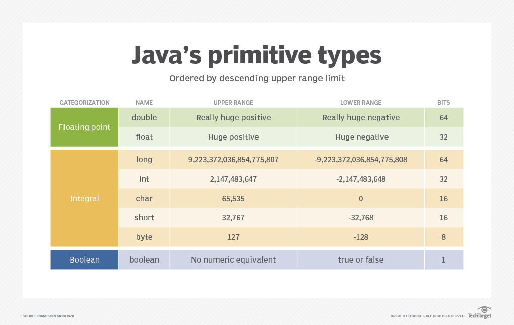

# Instructions  
### Description:
**Casting** is the process of converting data of one type to another. Here, we will explore the basics of casting values using primitives. In Java there are numerous primitive variables which all represent similar types of data. For instance, `byte`, `short`, `int` and `long` all represent whole number values. The difference betweent these primitives is the number of binary digits (bits) are used to represent these numbers.

The table below shows the number of bits used to represent each of the primitive datatypes in Java:



To *cast* values in java, place the desired datatype in a set of parentheses prior to the value you are trying to cast. For example, to cast a double to a byte, the syntax would be as follows:
```Java
(byte) 9.1792
```
Casting between datatypes can become a bit confusing if you are unfamiliar with binary number calculations. You don't need to be an expert at calculating binary numbers, nor do you need to memorize the upper and lower limit of primitive ranges to be a developer. However, you should recognize that casting from a larger datatype to a smaller datatype can have an impact on how the data is returned.

### Steps:
1. Add the following code to your **main()** method in your **Main** class, then run the program:
```Java
System.out.println("float to int:");
float f = 3.99F;
int i = (int)f;
System.out.println(i);
```
You should see the following output:
```
3
```
Since the datatype `int` can only store whole numbers, all values after the decimal place of the floating point value are truncated, or dropped off. Note that Java is not performing any type of rounding, the numbers are simply removed.

2. Next, add the following code to your **main()** method below your previous code, then run the program:
```Java
System.out.println("int to float:");
f = i;
System.out.println(f);
```
You should see the following output at the bottom of your console:
```
3.0
```
Here, we are performing the opposite cast; however, notice that we did not need to include the cast operation. In Java, if you cast from more descriptive or larger datatypes to smaller or less precise datatypes, Java will perform the cast for you automatically. In this case, a `float` value is more precise than an `int` and as such, Java can automatically cast the less precise `int` to a `float` with no explicit cast needed.

3. Add the following to your **main()** method below your previous code:
```Java
int x = 10;
float y = 3.755F;
System.out.println(x + y);
```
You should see the following output at the bottom of your console:
```
13.755
```
When you perform mathematical operations with variables of different datatypes, Java will automatically *upcast* the datatypes to the larger or most precise datatype of the two used in the operation. This means adding an `int` to a `float` would result in a `float` value.

4. Note that we can perform casting between any of the primitive datatypes (except booleans). Add the following code to your **main()** method and run the program:
```Java
char c = 'A';
System.out.println((int)c);
```
You should see the following output to the bottom of your console:
```
65
```
Internally, Java recognizes the character 'A' as the number 65, but through the context of the datatype `char` translates the value to the letter 'A'.

5. Your turn! use the cast operator to convert the character `'Z'` to a byte and print the result to the console.

### Test:
Use the test provided.

#### Sample output:
```
3
3.0
13.755
65
90
```